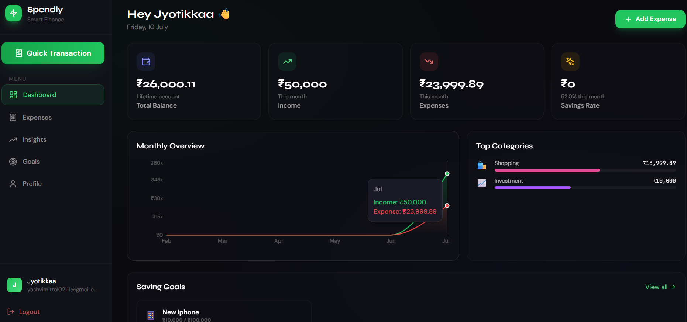
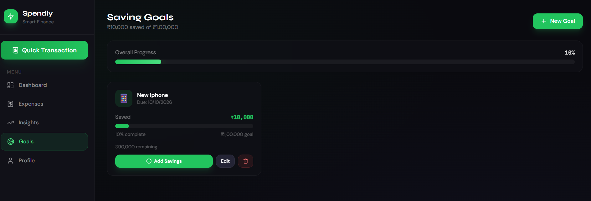

<div align="center">

# 💸 Spendly
### Smart Expense Tracker

**A full-stack AI-powered expense tracker with auto category detection, monthly insights with charts, smart overspending alerts, and a saving goals system.**

</div>

---

## 🖼 Screenshots

<div align="center">

**Dashboard — Monthly Overview**



*At a glance: total balance, monthly income vs. expenses, savings rate, a 6-month income/expense trend, and top spending categories.*

<br/>

**Saving Goals**



*Track saving goals with visual progress bars, deadlines, and quick actions to add savings, edit, or delete a goal.*

</div>

---

## 🚀 Tech Stack

| Layer | Tech |
|-------|------|
| Frontend | React 18 + Vite + Tailwind CSS |
| Charts | Recharts |
| Backend | Node.js + Express |
| Database | MongoDB + Mongoose |
| Auth | JWT (JSON Web Tokens) |
| Cron Jobs | node-cron (monthly reports) |
| Icons | Lucide React |
| Notifications | react-hot-toast |

---

## 📁 Project Structure

```
smart-expense-tracker/
├── backend/
│   ├── config/         # DB connection
│   ├── controllers/    # Route handlers (auth, expenses, goals, insights)
│   ├── middleware/     # JWT auth middleware
│   ├── models/         # Mongoose schemas (User, Expense, Goal)
│   ├── routes/         # Express routes
│   ├── services/       # AI category detection + cron jobs
│   ├── .env.example
│   ├── package.json
│   └── server.js
│
└── frontend/
    ├── src/
    │   ├── components/
    │   │   ├── auth/
    │   │   ├── dashboard/   # AlertBanner
    │   │   ├── expenses/    # AddExpenseModal (with AI)
    │   │   └── layout/      # Sidebar + Layout
    │   ├── context/         # AuthContext
    │   ├── pages/           # Dashboard, Expenses, Insights, Goals, Profile
    │   ├── services/        # Axios API service
    │   ├── App.jsx
    │   ├── main.jsx
    │   └── index.css
    ├── index.html
    ├── vite.config.js
    ├── tailwind.config.js
    └── package.json
```

---

## ⚙️ Setup & Installation

### Prerequisites
- Node.js v18+
- MongoDB (local or Atlas)

---

### 1. Clone & Setup Backend

```bash
cd smart-expense-tracker/backend
cp .env.example .env
# Edit .env with your MongoDB URI and JWT secret
npm install
npm run dev
```

Backend starts at: `http://localhost:5000`

---

### 2. Setup Frontend

```bash
cd smart-expense-tracker/frontend
npm install
npm run dev
```

Frontend starts at: `http://localhost:5173`

---

### 3. MongoDB Setup

**Option A — Local MongoDB:**
```
MONGODB_URI=mongodb://localhost:27017/expense-tracker
```

**Option B — MongoDB Atlas (Free):**
1. Go to https://cloud.mongodb.com
2. Create free cluster
3. Get connection string
4. Paste in `.env`

---

## ✨ Features

### 🤖 AI Category Detection
- Type a transaction title (e.g. "Zomato biryani") and AI auto-detects the category
- Supports: Food, Transport, Shopping, Entertainment, Health, Education, Bills, Housing, Travel, Salary, Freelance, Investment
- Shown with an `AI` badge on transactions

### 📊 Monthly Insights & Charts
- Income vs Expense bar chart (6-month trend)
- Spending by category (pie chart)
- Daily spending line chart
- Category breakdown table with progress bars

### 🔔 Smart Alerts
- "You overspent on Food 😬" — compares vs last month
- Budget exceeded / 85% warning alerts
- Food spending high alert (>₹5000/month)
- Dismissible alert banners

### 🎯 Goal Saving System
- Create saving goals with custom icons & colors
- Track progress with visual progress bars
- Add savings amounts incrementally
- Auto-marks complete when target reached
- Deadline tracking

### 📅 Monthly Cron Reports
- Runs on 1st of every month at 9 AM
- Daily spending check at 8 PM
- Budget alert notifications (extend with Nodemailer for email)

### 🔐 Auth System
- Register / Login with JWT
- Protected routes (auto-redirect)
- Token auto-refresh via axios interceptors

---

## 🌐 API Endpoints

### Auth
| Method | Route | Description |
|--------|-------|-------------|
| POST | `/api/auth/register` | Register |
| POST | `/api/auth/login` | Login |
| GET | `/api/auth/me` | Get current user |
| PUT | `/api/auth/profile` | Update profile |

### Expenses
| Method | Route | Description |
|--------|-------|-------------|
| GET | `/api/expenses` | List with filters |
| POST | `/api/expenses` | Add (AI category) |
| PUT | `/api/expenses/:id` | Update |
| DELETE | `/api/expenses/:id` | Delete |
| POST | `/api/expenses/detect-category` | AI detect |

### Goals
| Method | Route | Description |
|--------|-------|-------------|
| GET | `/api/goals` | All goals |
| POST | `/api/goals` | Create |
| PUT | `/api/goals/:id` | Update |
| POST | `/api/goals/:id/savings` | Add savings |
| DELETE | `/api/goals/:id` | Delete |

### Insights
| Method | Route | Description |
|--------|-------|-------------|
| GET | `/api/insights/monthly?month=4&year=2026` | Monthly data |

---

## 📦 Production Build

```bash
# Build frontend
cd frontend && npm run build

# Serve with nginx or any static host
# Backend can be deployed to Railway, Render, etc.
```

---

## 🔧 Environment Variables

```env
PORT=5000
MONGODB_URI=mongodb://localhost:27017/expense-tracker
JWT_SECRET=your_super_secret_key
JWT_EXPIRE=7d
NODE_ENV=development
```

---

<div align="center">

Made with ❤️ — Spendly MVP v1.0

</div>
